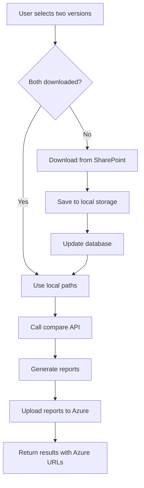
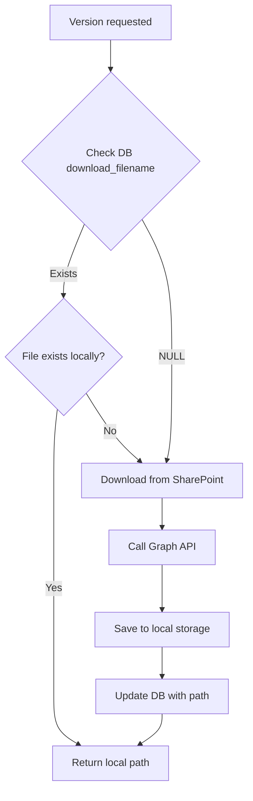

# SharePoint Integration Migration Plan
## Replacing Azure Blob Storage with SharePoint Version History

**Document Version**: 1.0  
**Date**: December 2024  
**Status**: Planning Phase

---

## Executive Summary

This document outlines the plan to migrate from Azure Blob Storage to SharePoint version history for Excel file management while maintaining Azure storage for generated reports. The system will download files from SharePoint on-demand and maintain persistent local storage for all downloaded versions.

---

## 1. Current State Analysis

### 1.1 Database Structure

#### tracked_files table
| Column | Type | Description | Status |
|--------|------|-------------|--------|
| id | int | Primary key | Exists |
| sharepoint_url | varchar | Full SharePoint sharing URL | Exists |
| file_name | varchar | Original filename (e.g., "STTM workingversion.xlsx") | Exists |
| friendly_name | varchar | User-friendly display name | Exists |
| drive_id | varchar | Microsoft Graph API drive identifier | Exists ✅ |
| item_id | varchar | Microsoft Graph API item identifier | Exists ✅ |
| is_active | boolean | Active tracking status | Exists |
| created_at | datetime | Record creation timestamp | Exists |
| last_checked_at | datetime | Last version check timestamp | Exists |

#### file_versions table
| Column | Type | Description | Current Usage | Future Usage |
|--------|------|-------------|---------------|--------------|
| id | int | Version ID | Primary key | No change |
| file_id | int | Foreign key to tracked_files | Links to parent | No change |
| sequence_number | int | Version sequence (1,2,3...) | Version ordering | No change |
| sharepoint_version_id | varchar | SharePoint version (1.0, 2.0...) | Version identifier | Source for download |
| modified_datetime | datetime | SharePoint modification time | Metadata | No change |
| file_size_bytes | bigint | File size | Metadata | Validation |
| downloaded | boolean | Download status | Tracks Azure upload | Tracks local download |
| download_filename | varchar | File location | Azure blob URLs | Local file paths |
| downloaded_at | datetime | Download timestamp | Azure upload time | Local download time |
| download_error | varchar | Error message | Azure errors | SharePoint errors |

### 1.2 Current Azure Integration Points
- Excel files stored in Azure Blob container: `excel-files`
- Reports uploaded to Azure Blob container: `diff-reports` (KEEP THIS)
- SAS URL generation for secure access

---

## 2. Target Architecture

### 2.1 SharePoint Integration Components

```
EXCELDIFF_WEB/
├── sharepoint/
│   ├── __init__.py
│   ├── sharepoint_service.py    # Microsoft Graph API operations
│   ├── download_service.py      # Version download logic
│   └── config.py                # SharePoint configuration
├── downloads/
│   └── excel_versions/          # Persistent local storage
│       └── {file_name_base}/    # Organized by file
│           ├── {file_name_base}_seq1_v1.0_{timestamp}.xlsx
│           ├── {file_name_base}_seq2_v2.0_{timestamp}.xlsx
│           └── {file_name_base}_seq7_v7.0_{timestamp}.xlsx
└── api.py                       # Modified endpoints
```

### 2.2 Local Storage Strategy

#### Directory Structure
```
downloads/excel_versions/
└── STTM_workingversion/
    ├── STTM_workingversion_seq1_v1.0_20250904_210303.xlsx
    ├── STTM_workingversion_seq2_v2.0_20250904_210405.xlsx
    └── STTM_workingversion_seq7_v7.0_20250904_210617.xlsx
```

#### File Naming Convention
```
Pattern: {file_name_base}_seq{sequence_number}_v{sharepoint_version_id}_{timestamp}.xlsx

Where:
- file_name_base: file_name without extension, spaces replaced with underscores
- sequence_number: From file_versions table
- sharepoint_version_id: Version from SharePoint (dots replaced with underscores)
- timestamp: YYYYMMDD_HHMMSS format

Example:
- Original file_name: "STTM workingversion.xlsx"
- Clean base name: "STTM_workingversion"
- Final filename: "STTM_workingversion_seq1_v1_0_20250904_210303.xlsx"
```

### 2.3 Download Management Logic

```python
def get_file_for_comparison(file_id, version_id):
    """
    1. Check file_versions.download_filename
    2. If exists and file exists locally → return path
    3. If not → download from SharePoint:
       a. Create directory if needed
       b. Download file using Graph API
       c. Save to local storage
       d. Update database with path
       e. Set downloaded=True, downloaded_at=now()
    4. Return local path
    """
```

---

## 3. Implementation Phases

### Phase 1: SharePoint Service Setup (Week 1)

#### 1.1 Environment Configuration
Add to `.env`:
```env
# Microsoft Graph API Configuration
MICROSOFT_CLIENT_ID=af95bf83-4ce7-4894-ade5-0ad61d2f7ecc
MICROSOFT_CLIENT_SECRET=xxx
MICROSOFT_TENANT_ID=b16b5078-3c36-482e-b98e-b986822e8f7f

# SharePoint Settings
SHAREPOINT_SITE_URL=https://pursuitsoftwarebiz-my.sharepoint.com
GRAPH_API_SCOPE=https://graph.microsoft.com/.default

# Local Storage Configuration
LOCAL_STORAGE_PATH=./downloads/excel_versions
KEEP_DOWNLOADED_FILES=true
MAX_FILE_SIZE_MB=100

# Keep existing Azure settings for reports
AZURE_STORAGE_CONNECTION_STRING=xxx
AZURE_REPORTS_CONTAINER_NAME=diff-reports
UPLOAD_REPORTS_TO_AZURE=true
```

#### 1.2 Dependencies
Add to `requirements.txt`:
```
msal>=1.24.0          # Microsoft Authentication Library
requests>=2.31.0      # Already exists
tenacity>=8.2.3       # Retry logic
```

#### 1.3 Create SharePoint Service Module
Files to create:
- `sharepoint/__init__.py`
- `sharepoint/config.py` - Configuration management
- `sharepoint/sharepoint_service.py` - Graph API operations
- `sharepoint/download_service.py` - Download logic

### Phase 2: API Endpoints (Week 1-2)

#### 2.1 New Endpoint: Download SharePoint Version
```python
@app.post("/api/download-sharepoint-version")
async def download_sharepoint_version(
    file_id: int = Form(...),
    version_id: int = Form(...),
    force_download: bool = Form(False)
):
    """
    Download a specific version from SharePoint.
    
    Returns:
    {
        "status": "success",
        "local_path": "downloads/excel_versions/STTM_workingversion/...",
        "file_size": 182358,
        "downloaded_at": "2024-12-07T10:30:00",
        "from_cache": false
    }
    """
```

#### 2.2 New Endpoint: Get Version Status
```python
@app.get("/api/get-version-status/{file_id}")
async def get_version_status(file_id: int):
    """
    Get download status for all versions of a file.
    
    Returns:
    {
        "file_info": {
            "file_id": 2,
            "file_name": "STTM workingversion.xlsx",
            "friendly_name": "STTM Working Version File"
        },
        "versions": [
            {
                "version_id": 99,
                "sequence_number": 1,
                "sharepoint_version_id": "1.0",
                "downloaded": true,
                "local_path": "downloads/excel_versions/...",
                "file_exists": true
            }
        ]
    }
    """
```

#### 2.3 Modified Endpoint: Compare Versions
```python
@app.post("/api/compare-versions")
# Enhanced to handle:
# 1. Local paths (downloaded versions)
# 2. Azure URLs (backward compatibility)
# 3. Version IDs (triggers SharePoint download)
# 4. Mixed sources (one local, one SharePoint)
```

### Phase 3: Download Service Implementation (Week 2)

#### 3.1 Core Download Function
```python
class DownloadService:
    def download_version(self, tracked_file, version_info):
        """
        1. Generate local filename
        2. Check if already exists
        3. Download from SharePoint if needed
        4. Update database
        5. Return local path
        """
```

#### 3.2 SharePoint Integration
```python
class SharePointService:
    def get_version_download_url(self, drive_id, item_id, version_id):
        """Get temporary download URL from SharePoint"""
        
    def download_file(self, download_url, local_path):
        """Download file with progress tracking"""
```

### Phase 4: Database Migration (Week 2)

#### 4.1 Migration Script
```sql
-- Clear Azure URLs, prepare for local paths
UPDATE file_versions 
SET downloaded = 0,
    download_filename = NULL
WHERE download_filename LIKE 'https://stexceldifffiles.blob%';

-- Keep SharePoint metadata intact
-- drive_id and item_id already populated
```

#### 4.2 Database Access Pattern
```python
def update_version_download(version_id, local_path):
    """
    UPDATE file_versions
    SET download_filename = ?,
        downloaded = 1,
        downloaded_at = GETDATE(),
        download_error = NULL
    WHERE id = ?
    """
```

### Phase 5: Frontend Updates (Week 3)

#### 5.1 Version List Enhancement
```javascript
// Show download status for each version
{
    version_id: 99,
    sequence_number: 1,
    sharepoint_version_id: "1.0",
    downloaded: true,
    local_path: "downloads/excel_versions/...",
    download_status: "ready" // ready|downloading|error|not_downloaded
}
```

#### 5.2 Download UI Components
```html
<!-- Add to version card -->
<div class="download-status">
    <span v-if="version.downloaded" class="text-green-600">
        ✓ Downloaded
    </span>
    <button v-else @click="downloadVersion(version)" class="btn-download">
        Download Version
    </button>
</div>
```

#### 5.3 Comparison Flow Update
```javascript
async compareVersions() {
    // 1. Check if both versions downloaded
    // 2. Download if needed
    // 3. Show progress
    // 4. Call comparison API with local paths
}
```

---

## 4. Integration Flow

### 4.1 Version Comparison Workflow



### 4.2 Download Decision Tree



---

## 5. Testing Strategy

### 5.1 Unit Tests
- SharePoint authentication
- Graph API connection
- Version download
- Local storage management
- Database updates

### 5.2 Integration Tests
- End-to-end download flow
- Comparison with SharePoint versions
- Mixed source comparisons (local + SharePoint)
- Error handling and retry logic

### 5.3 Test Scenarios
1. First-time download
2. Using cached version
3. Re-download corrupted file
4. Large file handling
5. Network failure recovery
6. Concurrent downloads
7. Storage cleanup

---

## 6. Rollback Plan

### 6.1 Phased Rollback
1. Keep Azure blob URLs in database
2. Maintain dual-source support
3. Flag to switch between Azure and SharePoint
4. Gradual migration per file

### 6.2 Data Recovery
- Backup file_versions table before migration
- Keep Azure blobs until SharePoint proven stable
- Log all downloads for audit trail

---

## 7. Performance Considerations

### 7.1 Caching Strategy
- Check local storage first (milliseconds)
- Download only when needed (seconds)
- Parallel downloads for multiple versions
- Connection pooling for Graph API

### 7.2 Storage Management
- Monitor disk usage
- Implement storage quotas per file
- Optional cleanup for versions older than X days
- Compress old versions if needed

### 7.3 API Rate Limits
- Microsoft Graph: 10,000 requests per 10 minutes
- Implement exponential backoff
- Queue downloads if rate limited
- Cache Graph API tokens (1 hour)

---

## 8. Security Considerations

### 8.1 Authentication
- Client credentials flow (app-only)
- Secure storage of secrets in .env
- Token refresh before expiry
- Audit log for all downloads

### 8.2 File Security
- Validate file types before download
- Scan for malware if configured
- Restrict file size limits
- Secure local storage permissions

---

## 9. Migration Timeline

### Week 1
- [ ] Setup SharePoint service modules
- [ ] Configure environment variables
- [ ] Test Graph API connection
- [ ] Create local storage structure

### Week 2
- [ ] Implement download service
- [ ] Create new API endpoints
- [ ] Update database schema
- [ ] Test download functionality

### Week 3
- [ ] Update frontend components
- [ ] Integrate with comparison flow
- [ ] End-to-end testing
- [ ] Performance optimization

### Week 4
- [ ] Production deployment
- [ ] Monitor and optimize
- [ ] Documentation update
- [ ] Team training

---

## 10. Success Criteria

### Functional Requirements
- ✅ Download versions from SharePoint on-demand
- ✅ Store downloads permanently in local storage
- ✅ Update database with local paths
- ✅ Maintain backward compatibility
- ✅ Keep Azure for report storage

### Performance Requirements
- Local file access: < 100ms
- SharePoint download: < 30s for 10MB file
- Comparison process: No regression from current
- Storage efficiency: < 1GB per tracked file

### Reliability Requirements
- 99.9% availability for local files
- Automatic retry for failed downloads
- Graceful degradation if SharePoint unavailable
- No data loss during migration

---

## 11. Maintenance and Operations

### 11.1 Monitoring
- Download success/failure rates
- Storage usage trends
- API response times
- SharePoint API quota usage

### 11.2 Maintenance Tasks
- Weekly: Check storage usage
- Monthly: Clean orphaned downloads
- Quarterly: Review download patterns
- Yearly: Archive old versions

### 11.3 Support Documentation
- Troubleshooting guide
- Common error messages
- Download status codes
- Recovery procedures

---

## 12. Appendices

### A. Error Codes
| Code | Description | Action |
|------|-------------|--------|
| SP001 | SharePoint authentication failed | Check credentials |
| SP002 | Version not found | Verify version exists |
| SP003 | Download timeout | Retry with backoff |
| SP004 | Storage full | Clean up old files |
| SP005 | File corrupted | Re-download |

### B. Configuration Examples
```python
# SharePoint service initialization
sharepoint_service = SharePointService(
    client_id=settings.MICROSOFT_CLIENT_ID,
    client_secret=settings.MICROSOFT_CLIENT_SECRET,
    tenant_id=settings.MICROSOFT_TENANT_ID
)

# Download service usage
download_service = DownloadService(
    storage_path=settings.LOCAL_STORAGE_PATH,
    max_file_size_mb=settings.MAX_FILE_SIZE_MB
)
```

### C. Database Queries
```sql
-- Find versions needing download
SELECT fv.*, tf.file_name, tf.drive_id, tf.item_id
FROM file_versions fv
JOIN tracked_files tf ON fv.file_id = tf.id
WHERE fv.downloaded = 0
  AND tf.is_active = 1;

-- Check local storage usage
SELECT tf.file_name, 
       COUNT(fv.id) as version_count,
       SUM(CASE WHEN fv.downloaded = 1 THEN 1 ELSE 0 END) as downloaded_count
FROM tracked_files tf
LEFT JOIN file_versions fv ON tf.id = fv.file_id
GROUP BY tf.id, tf.file_name;
```

---

**Document End**

Last Updated: December 2024  
Next Review: After Phase 1 Implementation